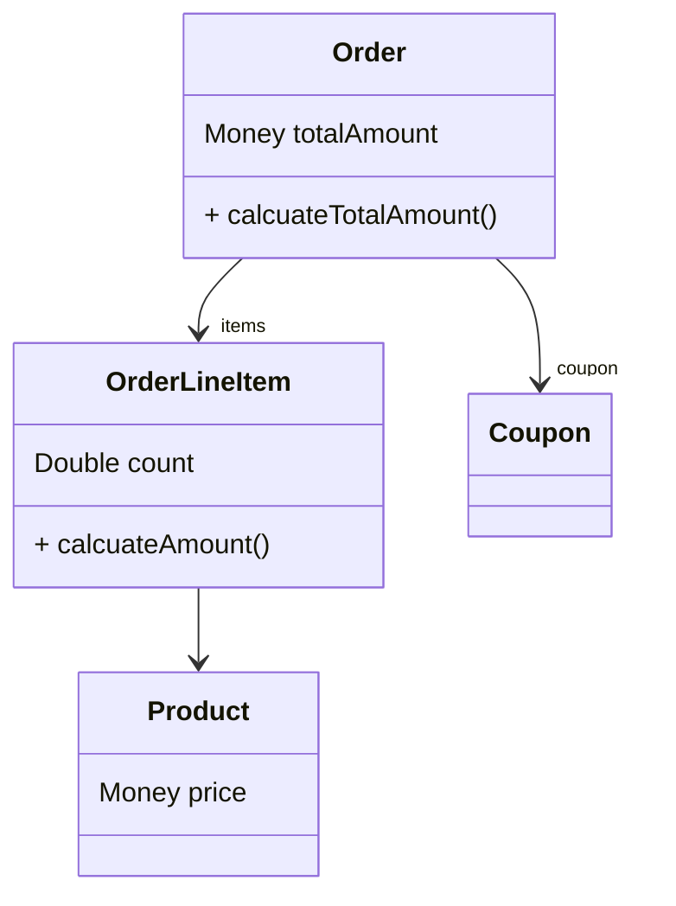

# 객체지향 설계

## 쿠폰 도메인

- 쿠폰은 "할인 금액 계산"과 "할인 조건 판단"이라는 두 가지 책임을 가짐

- 할인 금액 계산
    - 쿠폰의 할인 계산 방식은 "정액 할인", "정률 할인"이 있음
    - `Coupon` 추상 클래스를 통해 할일 금액 계산 역할을 추상화
- 할인 조건 판단
    - 할인 조건에는 "기간 조건", "금액 조건" 등이 있음
    - `DiscountCondition` 인터페이스를 통해 할인 조건 판단 역할을 추상화
    - 단일 조건의 조합을 나타내기 위해 Composite 패턴 적용

- 새로운 조건이나 할인 방식이 추가되더라도 기존 코드를 수정하지 않고 확장 가능하도록


### 1. Coupon

<style>
  th{
    text-align: center;
  }
  td {
    text-align: center;
  }
</style>

<table>
  <tr>
    <td></td>
    <td>PercentDiscountCoupon</td>
    <td>AmountDiscountCoupon</td>
  </tr>
  <tr>
    <td rowspan>역할</td>
    <td colspan="2">쿠폰의 할인 금액 계산</td>
  </tr>
  <tr>
    <td>상세</td>
    <td>고정 비율만큼 할인</td>
    <td>고정 금액만큼 할인</td>
  </tr>
</table>

```kotlin

sealed class Coupon(
    /**
     * 사용(할인) 조건
     */
    val condition: DiscountCondition
) {
    // ...

    fun calculateDiscount(amount: Money): Money {
        if (condition.isSatisfiedBy(amount)) {
            return getDiscountAmount(amount)
        }

        return Money.ZERO
    }

    abstract fun getDiscountAmount(amount: Money): Money
}

```

### 2. DiscountCondition

```kotlin

sealed interface DiscountCondition {
    fun isSatisfiedBy(amount: Money): Boolean
}

```

<table>
  <tr>
    <td></td>
    <td>PeriodCondition</td>
    <td>AmountCondition</td>
    <td>NoneCondition</td>
  </tr>
  <tr>
    <td rowspan>역할</td>
    <td colspan="3">쿠폰의 할인 조건 판단</td>
  </tr>
  <tr>
    <td>상세</td>
    <td>사용 가능한 날짜인 경우 참</td>
    <td>최소 주문 금액 이상인 경우 참</td>
    <td>조건 없이 항상 참</td>
  </tr>
</table>
- Compoiste 패턴 적용 
<table>
  <tr>
    <td></td>
    <td>AnyCondition</td>
    <td>AllCondition</td>
  </tr>
  <tr>
    <td>상세</td>
    <td>여러 조건 중 모든 조건이 충족하는 경우</td>
    <td>여러 조건 중 하나라도 충족하는 경우 </td>
  </tr>
</table>

## 주문 도메인

