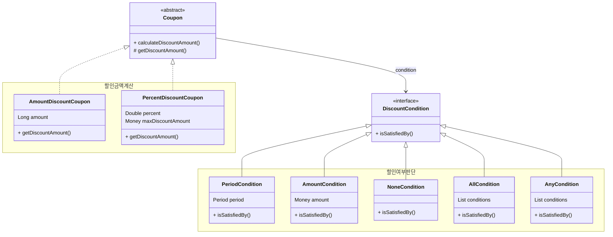
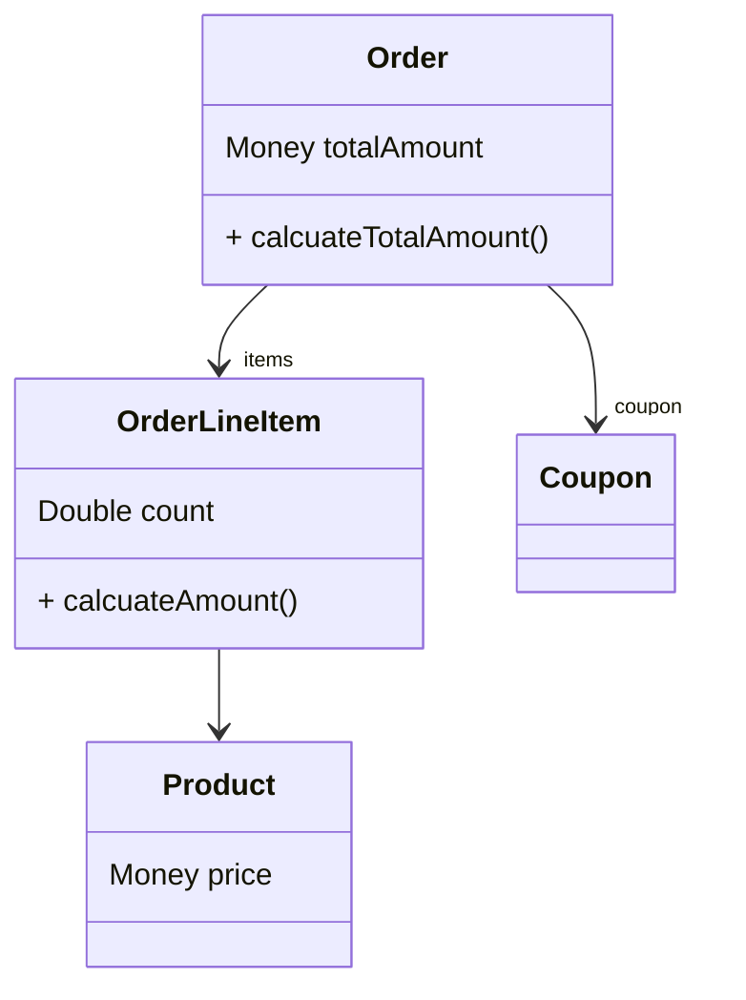

# 객체지향 설계

- 변경의 영향이 전파되는 강한 결합도의 절차지향 설계의 문제점을 해결
- 데이터와 프로세스를 하나의 객체로 묶어 스스로 책임을 수행하도록 구현    
- 요구사항 변경 시 기존 코드를 수정하지 않고 확장을 통해 변경 가능하도록함

## 1. 쿠폰 도메인

- 쿠폰은 "할인 금액 계산"과 "할인 여부 판단"이라는 두 가지 역할(기능)을 담당
- 클래스마다 각각 하나의 책임을 갖고 협력을 통해 쿠폰 도메인의 전체 기능을 구현



### 1-1. Coupon

<table>
  <tr>
    <td></td>
    <td>PercentDiscountCoupon</td>
    <td>AmountDiscountCoupon</td>
  </tr>
  <tr>
    <td rowspan>책임</td>
    <td colspan="2">쿠폰의 할인 금액 계산</td>
  </tr>
  <tr>
    <td>상세</td>
    <td>고정 비율만큼 할인</td>
    <td>고정 금액만큼 할인</td>
  </tr>
</table>

```kotlin
sealed class Coupon(
    /**
     * 사용(할인) 조건
     */
    val condition: DiscountCondition
) {
    // ...

    fun calculateDiscount(amount: Money): Money {
        if (condition.isSatisfiedBy(amount)) {
            return getDiscountAmount(amount)
        }

        return Money.ZERO
    }

    abstract fun getDiscountAmount(amount: Money): Money
}

class AmountDiscountCoupon(
    val amount: Money
) {
    override fun getDiscountAmount(amount: Money): Money {
        return this.amount
    }
}

class PercentDiscountCoupon(
    val percent: BigDecimal,
    val maxDiscountAmount: Money 
) {
    override fun getDiscountAmount(amount: Money): Money {
        val discounted = amount.multiply(percent)

        if (discounted.isLessThan(maxDiscountAmount)) {
            return discounted
        }
        return maxDiscountAmount
    }
}
```

### 1-2. DiscountCondition

<table>
  <tr>
    <td></td>
    <td>PeriodCondition</td>
    <td>AmountCondition</td>
    <td>NoneCondition</td>
  </tr>
  <tr>
    <td rowspan>책임</td>
    <td colspan="3">쿠폰의 할인 여부 판단</td>
  </tr>
  <tr>
    <td>상세 구현</td>
    <td>사용 가능한 날짜인 경우 참</td>
    <td>최소 주문 금액 이상인 경우 참</td>
    <td>조건 없이 항상 참</td>
  </tr>
</table>

```kotlin

sealed interface DiscountCondition {
    fun isSatisfiedBy(amount: Money): Boolean
}

class AmountCondition(
    val amount: Money
) {
    override fun isSatisfiedBy(amount: Money): Boolean {
        return amount.isGreaterThanOrEqual(this.amount)
    }
}

class PeriodCondition(
    val period: Period
) {
    override fun isSatisfiedBy(amount: Money): Boolean {
        return period.isWithin(LocalDateTime.now())
    }
}

```

- 복합 할인 조건을 위한 `Composite Pattern`적용
- 클라이언트는 인터페이스를 통해 개별, 복합 조건을 동일하게 사용

<table>
  <tr>
    <td></td>
    <td>AnyCondition</td>
    <td>AllCondition</td>
  </tr>
  <tr>
    <td>상세 구현</td>
    <td>여러 조건 중 모든 조건이 충족하는 경우</td>
    <td>여러 조건 중 하나라도 충족하는 경우 </td>
  </tr>
</table>

```kotlin

class AllCondition(
    val conditions: List<DiscountCondition>
) : DiscountCondition {
    override fun isSatisfiedBy(amount: Money): Boolean {
        return conditions.all { it.isSatisfiedBy(amount) }
    }
}

class AnyCondition(
    val conditions: List<DiscountCondition>
) : DiscountCondition {
    override fun isSatisfiedBy(amount: Money): Boolean {
        return conditions.any { it.isSatisfiedBy(amount) }
    }
}

```


## 2. 주문 도메인



### 2-1. Order 


