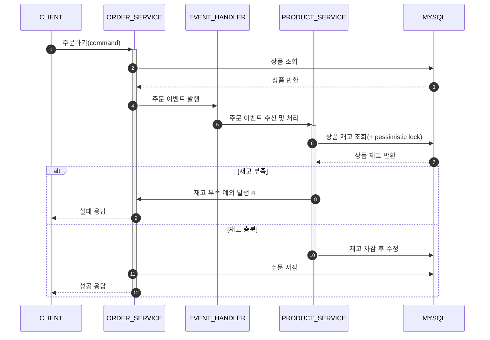
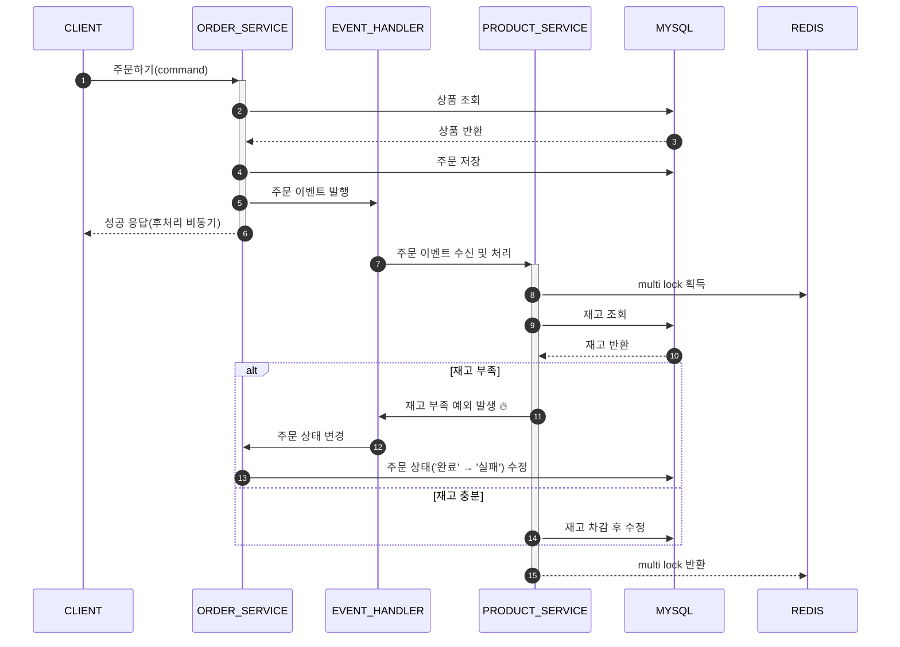

# 시퀀스 다이어그램

## 주문하기

### 1) 비관적 락(Pessimistic Lock)

```mermaid
sequenceDiagram
    autonumber
    participant CLIENT
    participant ORDER_SERVICE
    participant EVENT_HANDLER
    participant PRODUCT_SERVICE
    participant MYSQL
    CLIENT ->> + ORDER_SERVICE: 주문하기(command)
    ORDER_SERVICE ->> MYSQL: 상품 조회
    MYSQL -->> ORDER_SERVICE: 상품 반환
    ORDER_SERVICE ->> EVENT_HANDLER: 주문 이벤트 발행
    EVENT_HANDLER ->>  + PRODUCT_SERVICE: 주문 이벤트 수신 및 처리
    PRODUCT_SERVICE ->> MYSQL: 상품 재고 조회(+ pessimistic lock)
    MYSQL -->> PRODUCT_SERVICE: 상품 재고 반환

    alt 재고 부족
        PRODUCT_SERVICE ->> ORDER_SERVICE: 재고 부족 예외 발생 🔥
        ORDER_SERVICE -->> CLIENT: 실패 응답
    else 재고 충분
        PRODUCT_SERVICE ->> - MYSQL: 재고 차감 후 수정
        ORDER_SERVICE ->> MYSQL: 주문 저장
        ORDER_SERVICE -->> - CLIENT: 성공 응답
    end

```

### 2) 분산 락(Distributed Lock)

```mermaid
sequenceDiagram
    autonumber
    participant CLIENT
    participant ORDER_SERVICE
    participant EVENT_HANDLER
    participant PRODUCT_SERVICE
    participant MYSQL
    participant REDIS
    CLIENT ->> + ORDER_SERVICE: 주문하기(command)
    ORDER_SERVICE ->> MYSQL: 상품 조회
    MYSQL -->> ORDER_SERVICE: 상품 반환
    ORDER_SERVICE ->> MYSQL: 주문 저장
    ORDER_SERVICE ->> EVENT_HANDLER: 주문 이벤트 발행
    ORDER_SERVICE -->> - CLIENT: 성공 응답(후처리 비동기)
    EVENT_HANDLER ->> + PRODUCT_SERVICE: 주문 이벤트 수신 및 처리
    PRODUCT_SERVICE ->> REDIS: multi lock 획득
    PRODUCT_SERVICE ->> MYSQL: 재고 조회
    MYSQL -->> PRODUCT_SERVICE: 재고 반환

    alt 재고 부족
        PRODUCT_SERVICE ->> EVENT_HANDLER: 재고 부족 예외 발생 🔥
        EVENT_HANDLER ->> ORDER_SERVICE: 주문 상태 변경
        ORDER_SERVICE ->> MYSQL: 주문 상태('완료' → '실패') 수정
    else 재고 충분
        PRODUCT_SERVICE ->> MYSQL: 재고 차감 후 수정
    end
    PRODUCT_SERVICE -->> - REDIS: multi lock 반환


```

